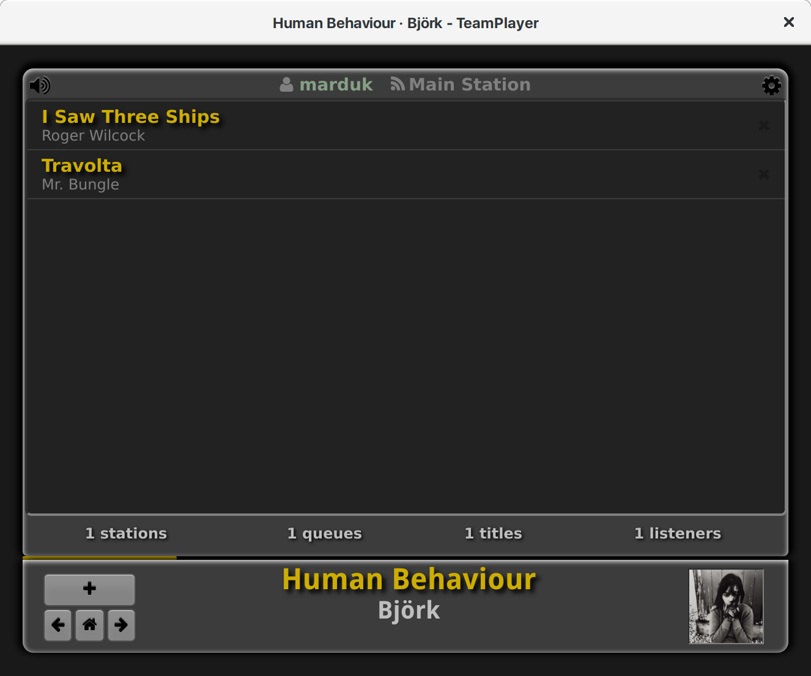

##########
TeamPlayer
##########

TeamPlayer is a  democratic Internet radio station.  Members create play
lists and the virtual DJ, DJ Ango,  goes from member to member playing a
title out of their list. Members  get to hear what their fellow members'
musical  interests  are,  and  contribute  titles  on  their  own.  With
TeamPlayer  everyone's musical  tastes are  heard and  everyone gets  an
equal chance to be heard.

Docker build
""""""""""""

TeamPlayer can be built inside of a `Docker <https://www.docker.com/>`_.  The
included ``Makefile`` makes this convenient::

    $ make docker

See ``tools/docker`` for the build instructions.  You can forgoe the
``Makefile`` and use the docker-compose recipes manually via, for example::

	$ docker-compose -f tools/docker/docker-compose.yml up

